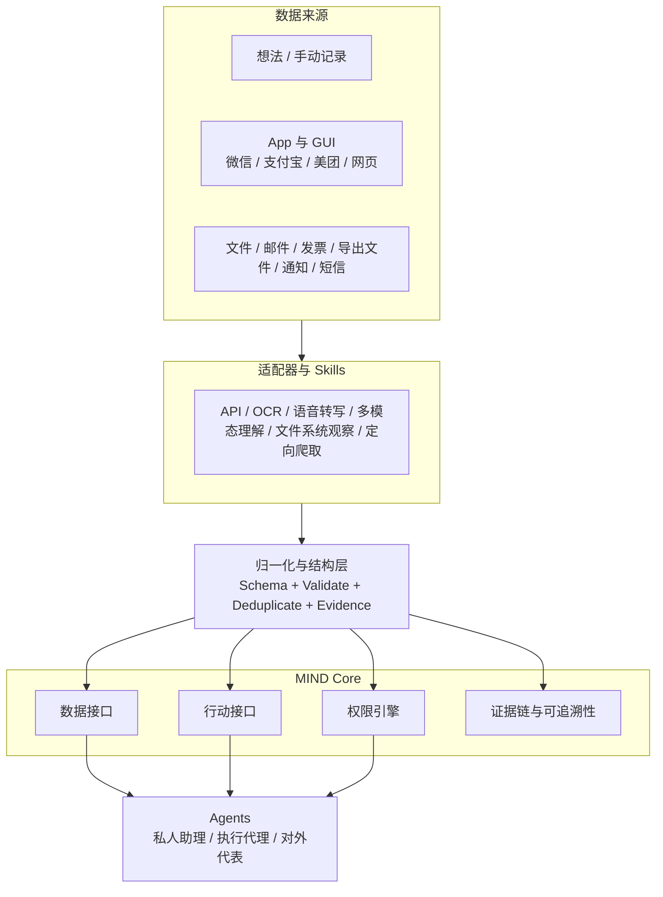

# MIND

> **My Interaction Data**
>
> 把原本困在 UI、对话、文件和记忆中的个人数据，变成 Agent 可调用的资源。

受王阳明“向内求”与“此心光明”的启发，MIND 从一个简单但重要的判断出发：

**对个人最重要的数据，首先来自你的思考、行动、关系和选择，而不是某个平台愿不愿意开放 API。**

平台可以不给你接口，但无法阻止你记录自己的想法、看到的界面、说过的话、保存过的文件，以及已经发生过的行为。你可以用纸笔记录，也可以用 MIND 以标准数据结构、权限分类和自动化流程来记录。MIND 的目标，就是把这些原本只对人可见的数据，转成对 Agent 也可理解、可调用、可执行的资源。

如果你愿意记录自己的“心”，任何 App 公司都无法阻碍你对自己数据的主权。

MIND 的前提始终是：处理用户拥有、控制或明确授权的数据，而不是越权抓取他人数据。

## 为什么是 MIND

今天的数字世界存在一个根本矛盾：

- 用户产生了大量数据，但数据的访问权被锁在各个平台里
- Agent 和大模型看起来很强，但往往拿不到真正属于用户的上下文
- 同一个人分散在微信、支付宝、美团、邮箱、文件夹、通知、短信里的信息，无法被统一调用
- 自动化能力依赖平台接口，而平台接口往往不完整、不稳定，甚至根本不存在

结果是：

- 你的数据看似很多，实际上不可编排
- 你的 Agent 看似聪明，实际上看不见你的真实世界
- 你的自动化看似可做，实际上被 App 孤岛切碎

MIND 要解决的，不是“再做一个 App”，而是定义：

**用户已经拥有的数据，如何被统一访问、统一理解、统一授权。**

## 为什么是现在

MIND 的窗口期来自三件事同时成立：

1. **Agent 正在成为新的软件入口**  
   未来每个人都会有多个 Agent：私人助理、执行代理、对外代表、垂直工作流代理。但没有用户级数据接口，Agent 只能停留在聊天层。

2. **多模态理解已经足够实用**  
   OCR、语音转写、视觉理解、UI 结构解析已经能够把“人能看懂的界面”转成“机器能处理的结构化数据”。

3. **平台 API 不会覆盖真正重要的个人上下文**  
   最重要的数据，恰恰常常不在开放接口里，而在聊天窗口、交易页面、通知栏、下载目录、手动记录和日常操作之中。

换句话说，过去的问题不是“用户没有数据”，而是**用户没有属于自己的数据接口**。

## 核心判断

平台并不创造你的生活，它们只是截留了你生活的痕迹。

如果你没有思考、没有行动、没有沟通、没有支付、没有出行，平台本身拿不到任何关于你的真实数据。数据的源头是人，平台只是暂时控制了记录方式。

MIND 的世界观如下：

| 旧世界 | 新世界 |
| --- | --- |
| 数据默认属于平台 | 数据默认属于用户 |
| 访问方式由平台定义 | 访问方式由用户定义 |
| Agent 依赖平台开放接口 | Agent 依赖用户授权的数据层 |
| 自动化围绕单个 App | 自动化围绕个人真实世界 |

## MIND 是什么

MIND 是一个面向 Agent 的个人数据接口层。  
它把分散在各类应用、文件、对话与界面中的信息，转化为统一、结构化、带权限、可追溯的数据资源。

MIND 关注三件事：

- **Ingestion**: 数据如何接入
- **Schema**: 数据如何结构化
- **Permissions**: 数据按什么权限被读取、引用、执行和分享

这让其他通用智能体，例如私人助理、执行代理、对外代表，能够真正理解并作用于现实世界。

## MIND 不是什么

MIND 不是：

- 一个 API 网关
- 一个通用数据仓库
- 一个普通笔记应用
- 一个以保存录屏为目标的“录屏产品”

MIND 的重点不是把数据“存起来”，而是把数据**变成可被机器稳定调用的资源**。

## 架构概览



箭头表示数据从现实世界进入 MIND，再进入 Agent 的方向。

## 数据接入协议

MIND 采用统一的数据接入协议：

```text
fetch -> normalize -> validate -> deduplicate -> commit
```

支持的典型通道包括：

- `api`
- `screen_session`
- `audio_capture`
- `export`
- `email`
- `invoice`
- `web`
- `notification`
- `sms`
- `local_file`
- `crawler`
- `manual`

原则很简单：

- 有官方 API 时，优先使用
- 没有 API 时，使用用户授权的界面、文件和行为数据
- 无论数据来自哪里，最终都进入同一套资源模型

## 标准资源模型

MIND 不是以 UI 为中心，而是以资源为中心。

典型资源类型包括：

- `Thought`
- `Message`
- `Conversation`
- `Attachment`
- `Document`
- `Expense`
- `Mobility`
- `Task`

示例：

```json
{
  "id": "expense_meituan_20260303_122100",
  "type": "Expense",
  "source": "meituan",
  "channel": "screen_session",
  "amount": 32.5,
  "currency": "CNY",
  "category": "food",
  "timestamp": "2026-03-03T12:21:00+08:00",
  "raw_ref": "frame://2026-03-03/session-18/frame-321",
  "confidence": 0.94,
  "permissions": {
    "read": ["owner", "assistant"],
    "act": ["owner_approval_required"]
  }
}
```

一旦数据被标准化，Agent 就不必再理解“这是微信里的某条消息”或“这是美团页面上的某个订单卡片”，而只需要理解：

- 这是什么资源
- 和谁有关
- 何时发生
- 可信度如何
- 能否被进一步执行

## GUI -> Data: MIND 的关键创新

MIND 的核心判断之一是：

**平台不给 API，不代表数据不可获得。只要数据已经出现在用户可见、可听、可操作的界面上，它就可以在用户授权下被转成结构化数据。**

这不是“录屏功能”，而是一个 `GUI -> Data` 的过程。

通过以下能力组合：

- 屏幕录制
- OCR
- 语音转写
- 多模态理解
- UI 结构解析
- 文件系统观察

MIND 试图提取的不是视频本身，而是四类结构化结果：

1. **UI Text**  
   OCR 或转写后的可见文本，例如联系人名、群名、消息内容、时间、按钮文字、文件名。

2. **UI Event**  
   用户和界面的交互动作，例如打开会话、滚动聊天记录、点击文件、下载附件。

3. **UI Object**  
   界面中的结构对象，例如聊天气泡、文件卡片、图片缩略图、会话列表项、输入框。

4. **File Reference**  
   由界面动作导出的文件引用，例如某个 PDF 被打开、某张图片被保存、某个文件出现在下载目录。

这使得类似微信这样的封闭环境，也能在没有官方接口的情况下被还原成：

- 聊天列表
- 聊天内容
- 联系人关系
- 附件与文件路径
- 会话时间线
- 发送与接收状态

## 滑动处理与最小留存

MIND 的目标不是保存原始录屏，而是把录屏作为短暂的中间材料，用滑动窗口方式提取关键帧和结构化事件，然后尽快删除。

推荐的清理策略：

| 中间产物 | 处理完成后 |
| --- | --- |
| `video segment` | `commit` 后删除 |
| `intermediate frames` | 解析后删除 |
| `audio temp` | 转写后删除 |
| `evidence snapshots` | 仅在低置信度时保留少量 |

最终长期保留的应主要是：

- 结构化数据
- 必要的证据帧
- 用户明确需要保存的文件 blob

这保证 MIND 关注的是“事实与资源”，不是“囤积原始素材”。

## 证据链、置信度与可追溯性

MIND 中的每条资源都应尽量带上：

- `source`: 来源平台或系统
- `channel`: 接入通道
- `raw_ref`: 原始引用或证据位置
- `confidence`: 解析可信度

这样做的意义不是形式化，而是让 Agent 真正可用于严肃场景：

- 可以审计
- 可以回溯
- 可以纠错
- 可以在人机协同里按置信度决定是否需要确认

一个成熟的 Agent 系统，不应该只有“答案”，还应该知道自己**为什么这样判断，以及这条判断的证据强不强**。

## 权限不是附属功能，而是核心结构

MIND 不只是标准化数据，也要标准化权限。

至少应覆盖三层控制：

1. **读取权限**  
   谁可以看到这条资源。

2. **行动权限**  
   Agent 是否可以基于这条资源触发提醒、归档、发送、支付或其他动作，是否必须先审批。

3. **留存权限**  
   原始证据保留多久，保留到什么粒度，哪些高敏感内容只能本地存在。

这使 MIND 成为一个“可以被自动化使用”的系统，而不只是一个“可被查看”的系统。

## 示例：从聊天到执行

输入来自微信中的一句话：

> 明天上午把合同发给我

MIND 可以结合当前会话对象和历史上下文，把这句话转成：

```json
{
  "type": "Task",
  "title": "发送合同",
  "recipient": "conversation_peer",
  "deadline": "2026-03-23T12:00:00+08:00",
  "linked_resource": "attachment_contract_v3",
  "source": "wechat",
  "confidence": 0.88,
  "permissions": {
    "read": ["owner", "assistant"],
    "act": ["owner_approval_required"]
  }
}
```

随后 Agent 才有可能在正确上下文下执行：

- 自动提醒
- 自动定位对应文件
- 自动生成回复草稿
- 在用户审批后自动发送

这就是 MIND 与普通聊天记录、普通笔记、普通 OCR 的本质区别：

**它的输出不是“看得见的信息”，而是“能被进一步执行的资源”。**

## 设计原则

### 1. 用户主权

数据属于用户，而不是平台。

### 2. API 优先，但不依赖 API

有 API 时直接接；没有 API 时，仍然能通过用户授权的数据路径接入。

### 3. 结构优先

所有重要数据最终都必须进入标准资源模型，而不是停留在截图、视频、聊天界面或自由文本里。

### 4. Agent 原生

MIND 不是为 UI 而设计，而是为 Agent 调用、推理和执行而设计。

### 5. 可审计

资源、动作、证据、权限都应可追踪。

### 6. 最小化留存

尽量保留结构化结果，而不是无限制保留原始素材。

### 7. 高风险动作必须可审批

自动化不是失控，真正可用的自动化必须支持人类最后一跳确认。

## 为什么这件事重要

Agent 时代真正稀缺的，不会只是模型能力，而是**谁拥有用户真实世界的数据接口**。

如果没有 MIND 这样的层：

- Agent 看不到你的生活
- 自动化无法跨 App 连续执行
- 个人上下文依然被平台分割
- 用户永远只能租用自己的数据，而无法真正拥有它

而如果这层成立：

- 人的想法、对话、文件、交易、出行、通知和操作会第一次进入同一套语义系统
- Agent 将第一次拥有可持续、可授权、可审计的个人上下文
- “个人 API”会成为个人计算的新基础设施

## 总结

MIND 不只是一个数据层。

它是连接**人类、Agent 与现实世界**的接口层。

它试图把原本只存在于 UI 界面中的人类可见数据，转成 Agent 可调用的数据资源；把原本零散、封闭、不可编排的个人上下文，转成一个用户真正拥有的数据系统。

在旧世界里，平台定义你能访问什么。  
在新世界里，用户定义自己的数据如何被访问。
