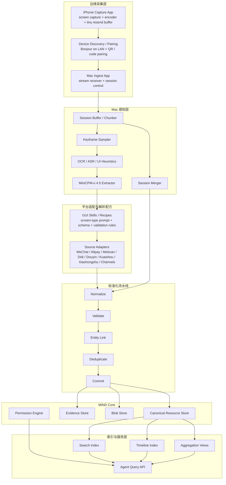

# MIND 架构草案

> 以三个具体 Agent 任务为牵引，反推 MIND 的系统架构、资源模型与文件夹框架

## 0. 这份文档回答什么问题

这不是一份“把所有能力都列上去”的大而全蓝图，而是从 3 个必须做对的任务反推：

1. MIND 至少要有哪些核心模块
2. 数据应该如何标准化
3. 为什么目录结构不能只按平台拆，也不能只按资源类型拆
4. MVP 第一阶段应该先做哪些能力

这 3 个任务分别代表了 MIND 最关键的三种能力：

- `跨平台交易归一化与汇总`
- `会话与附件检索`
- `带时间点快照的内容收藏记录`

如果这三类任务能做通，MIND 就已经不是“采集器”或“笔记工具”，而是一个真正能给 Agent 使用的个人数据层。

### 0.1 当前实现约束

基于你最新的问题，这份文档现在增加两个明确前提：

1. **MacBook Pro 是主计算节点**  
   录屏关键帧分析、信息抽取、合并、存储、权限分类都优先在 Mac 本地完成，`MiniCPM-o 4.5` 作为核心多模态感知引擎运行在 Mac 上。

2. **iPhone 是轻量采集节点**  
   iPhone 客户端的主要职责是采集屏幕流、做轻量编码和传输，尽量不长期存视频，只保留极短的发送缓冲以处理网络抖动和重传。

这意味着 MIND 的第一版不应该设计成“云端主导的数据平台”，而应该设计成：

**`iPhone Capture Edge -> Mac Ingest Node -> Local Perception and Canonicalization`**

另外，“默认永远开启”可以作为产品目标，但架构上更稳的做法是把它设计成：

- 可快速开启
- 可恢复的长会话
- 明确可见的录制状态
- 中断后可续传的采集链路

而不是把系统建立在“隐形后台永久录屏”这个脆弱假设上。

### 0.2 当前原型已经落地到哪里

当前仓库里的 Swift 原型已经实现了这条最小闭环：

- `iPhone SwiftUI App -> Bonjour 发现 -> NWConnection 推 keyframe`
- `iPhone Broadcast Upload Extension -> App Group 共享配置 -> 系统级录屏关键帧推流`
- `Mac SwiftUI App -> NWListener 接收 -> keyframe 落盘`
- `LiveIngestCoordinator -> recipe 选择 -> MiniCPM-o 4.5 bridge extraction -> session merge`
- `canonical commit -> JSON snapshot persistent store -> 3 条任务面板刷新`

这还不是最终架构，因为：

- `MiniCPM-o 4.5` 目前通过本地 Python bridge 接入，OCR / ASR 还没有拆成独立服务
- Broadcast Upload Extension 已经落下第一版，但传输层还没有 ack / 重传 / 断点恢复
- canonical store 已经持久化为本地 JSON snapshot，但还不是多表数据库或事件日志存储

但它已经足以验证：目录分层、协议边界和任务导向 pipeline 的方向是对的。

## 1. 三个任务到底在逼系统具备什么能力

### 任务 A

> 帮我把本周支付宝、美团、滴滴的消费按“差旅、餐饮、其他”分类汇总

这个任务表面上是记账，实际上要求系统具备：

- 多平台接入能力
- 交易类数据归一化能力
- 商户/订单/出行/消费之间的关联能力
- 分类规则与模型能力
- 时间范围过滤与聚合能力
- 可以回溯原始证据的能力

它逼 MIND 解决的问题是：

**不同平台长得完全不一样，但最后必须变成同一套 `Expense` 语义。**

### 任务 B

> 帮我找到我与微信好友陈攀聊天中的“宇树G1人形机器人操作经验手册.pdf”文件

这个任务表面上是搜索文件，实际上要求系统具备：

- 联系人身份解析能力
- 会话结构化能力
- 消息与附件关联能力
- 文件引用与文件实体分离能力
- 文件名、消息内容、联系人、时间等多维联合检索能力
- 从检索结果回到文件 blob 或原始证据的能力

它逼 MIND 解决的问题是：

**文件不是孤立对象，而是“在某段会话、某个关系、某次动作中出现的资源”。**

### 任务 C

> 给我我最近一周在抖音、快手、小红书和视频号收藏的视频的标题、收藏时间点和当时对应的点赞数，按时间顺序整理成表格给我

这个任务表面上是内容汇总，实际上要求系统具备：

- 多平台内容项归一化能力
- “收藏”这种用户动作的事件化记录能力
- 事件发生时指标快照的保留能力
- 时间排序和表格输出能力
- 将“当前点赞数”和“收藏时点赞数”明确区分的能力

它逼 MIND 解决的问题是：

**MIND 不能只存对象当前状态，还要存关键动作发生时的状态快照。**

## 2. 由三个任务推出的设计原则

从这三个任务出发，MIND 的架构应该坚持 7 个原则。

### 2.1 先事件，再对象

MIND 不能只保存“这个视频是什么”“这个文件是什么”“这笔消费是什么”，还要保存：

- 什么时候看见它
- 通过哪个界面或来源看见
- 当时做了什么动作
- 当时这个对象处在什么状态

所以底层必须同时有：

- `Resource`：稳定对象
- `Event`：发生过的动作
- `Snapshot`：关键时刻的状态切片

### 2.2 先标准化，再查询

如果每个任务直接对接平台原始结构，系统会很快失控。

所以平台差异必须尽量被消解在接入层，进入查询层之前至少要统一为：

- 通用资源
- 通用关系
- 通用时间语义
- 通用权限语义

### 2.3 原始证据不能丢，但也不能无限保留

三个任务都需要回到证据：

- 消费汇总要能追到订单/账单页面
- 文件搜索要能追到聊天消息和文件实体
- 收藏视频要能追到当时界面里的标题、点赞数和收藏动作

所以系统必须有证据链，但应采用最小留存策略，只保留：

- 结构化资源
- 必要证据帧
- 必要文件 blob

### 2.4 查询层必须是任务导向，而不是存储导向

用户提问不会说：

> 给我查一下 `content_item` 和 `metric_snapshot` 的 join

用户只会说：

> 给我最近一周收藏过的视频及当时点赞数

所以 MIND 需要两层接口：

- `Canonical Store`：统一资源存储
- `Serving Views / Query APIs`：面向任务的查询接口

### 2.5 权限必须是资源原生字段

这三个任务都涉及敏感数据：

- 消费数据
- 私聊文件
- 个人内容偏好

所以权限不能最后补，而要从资源入库时就写入。

### 2.6 “平台适配”与“领域语义”必须分开

支付宝、美团、滴滴、微信、抖音、快手、小红书、视频号都只是来源。

真正稳定的，是这些来源最后映射出的领域对象：

- `Expense`
- `Conversation`
- `Attachment`
- `ContentItem`
- `UserAction`

这决定了代码目录不能只按平台拆。

### 2.7 Adapter 不等于 Skill

如果你打算围绕 `MiniCPM-o 4.5` 来组织 GUI 解析能力，最稳的边界是：

- `Adapter`
  - 负责接入来源、管理会话状态、抽帧、补上下文、调用解析器
- `Extractor Service`
  - 负责运行 MiniCPM、OCR、ASR 等模型能力
- `Skill / Recipe`
  - 负责告诉模型“当前像什么页面、该抽什么字段、输出什么 schema”

所以答案不是“把整个 Adapter 做成 skill”，而是：

**把 Adapter 里的“页面理解与字段抽取规则”做成可版本化的 `skills/recipes`，而 Adapter 本身仍然应该是可测试、可观测、可回放的工程模块。**

## 3. 最小可行的分层架构



这套分层里，真正关键的不是“数据库选什么”，而是把职责切干净：

- `iPhone Capture App` 负责采集和低存储传输
- `Mac Ingest App` 负责接收会话流并控制解析过程
- `Perception` 负责关键帧抽取与多模态理解
- `Adapters + Recipes` 负责把解析结果映射为平台级中间语义
- `Pipeline` 负责标准化与链接
- `Core` 负责存 canonical resources 和 evidence
- `Serving` 负责给 Agent 高效查询

### 3.1 MiniCPM-o 4.5 在系统中的正确位置

如果你的核心实现选择是“在 MacBook Pro 本地跑 `MiniCPM-o 4.5` 来分析关键帧”，那它应该是一个**共享感知内核**，而不是分散在每个平台 Adapter 里的黑盒 prompt。

更推荐的结构是：

1. `services/vision-extractor`
   - 统一调度 MiniCPM-o 4.5
   - 输入关键帧、邻近帧、OCR 文本、当前 session metadata
   - 输出结构化 observations

2. `adapters/<platform>/gui/recipes/`
   - 定义页面类型
   - 定义提取字段
   - 定义输出 schema
   - 定义低置信度时需要保留什么证据

3. `services/session-merger`
   - 把连续帧上的识别结果合并为 UI Text / UI Event / UI Object / File Reference

这样做的好处是：

- 模型可以统一升级和替换
- 页面解析规则可以按平台、按页面独立版本化
- 低置信度和回退策略可以单独配置
- 更容易做回放测试和离线评估

如果你坚持用 `skill` 这个词，建议这样理解：

- `adapter` = 工程化接入模块
- `skill` = 面向 MiniCPM 的页面解析配方
- `pipeline` = 面向任务的编排逻辑

### 3.2 iPhone -> Mac 的实时录屏链路

你想做的是一个很明确的双端系统：

- iPhone 端负责实时采集
- Mac 端负责接收、抽帧、解析、存储、权限分类

推荐链路如下：

1. **发现与配对**
   - 同一局域网优先用 `Bonjour / mDNS`
   - 首次绑定用二维码或一次性 pairing code
   - 非同网时再考虑 relay、Tailscale 或其他中继方案

2. **传输层**
   - MVP 直接做点对点实时传输
   - 优先考虑 `WebRTC` 或基于 `QUIC` 的自定义流
   - 每个 session 切成小 chunk，带 sequence id、timestamp、device id、session id

3. **手机端存储策略**
   - 只保留极小的 ring buffer 用于重传
   - chunk 被 Mac 确认接收后立即删除
   - 不把完整录屏长期落在 iPhone 本地

4. **Mac 端处理策略**
   - 先接收 chunk 并形成 session buffer
   - 抽关键帧
   - 跑 OCR / ASR / MiniCPM-o 4.5
   - 合并成 observations
   - 进入 normalize -> validate -> link -> commit

5. **删除策略**
   - 原始 chunk 只作为短期中间材料
   - commit 后删除大部分视频段
   - 仅在低置信度、对账、审计需要时保留少量证据帧

这条链路的核心思想是：

**手机端尽量无状态，Mac 端才是系统的 system of record。**

## 4. 核心资源模型

MIND 的资源模型至少要覆盖下面这些对象。

### 4.1 基础元数据

- `SourceAccount`
  - 某个平台上的账号，如支付宝账号、微信账号、抖音账号
- `Identity`
  - 被解析后的统一身份，如联系人陈攀、用户自己
- `EvidenceRef`
  - 指向原始证据的位置，如帧截图、导出文件、HTML 片段、OCR 文本块

### 4.2 会话与文件

- `Conversation`
  - 一个单聊或群聊
- `Message`
  - 消息实体
- `Attachment`
  - 消息里的附件引用
- `FileAsset`
  - 统一文件实体，可能对应本地 blob、下载路径、哈希

关键关系：

- `Conversation` -> contains -> `Message`
- `Message` -> has_attachment -> `Attachment`
- `Attachment` -> resolves_to -> `FileAsset`
- `Conversation` -> participants -> `Identity`

### 4.3 交易与出行

- `Expense`
  - 一笔消费
- `Order`
  - 订单实体
- `Merchant`
  - 商户实体
- `Trip`
  - 出行实体，如滴滴行程
- `CategoryAssignment`
  - 消费分类结果及分类依据

关键关系：

- `Order` -> paid_by -> `Expense`
- `Expense` -> merchant -> `Merchant`
- `Expense` -> related_trip -> `Trip`
- `Expense` -> categorized_as -> `CategoryAssignment`

### 4.4 内容与用户动作

- `ContentItem`
  - 一个视频或内容卡片
- `CollectionEvent`
  - 用户执行“收藏”的动作
- `MetricSnapshot`
  - 某个时间点的点赞数、评论数、转发数等
- `PlatformPage`
  - 观察到该内容的页面上下文

关键关系：

- `CollectionEvent` -> target -> `ContentItem`
- `CollectionEvent` -> metric_snapshot -> `MetricSnapshot`
- `CollectionEvent` -> observed_on -> `PlatformPage`

## 5. 三个任务分别怎样映射到资源模型

### 5.1 任务 A: 本周消费分类汇总

建议查询链路：

1. 从 `Expense` 按时间范围取最近一周
2. 过滤 `source in [alipay, meituan, didi]`
3. join `Merchant` / `Trip` / `Order`
4. 根据 `CategoryAssignment` 输出为 `差旅 / 餐饮 / 其他`
5. 聚合金额、笔数、平台分布
6. 每条结果保留 `evidence_ref`

这里的关键不是 `Expense.amount`，而是分类逻辑。

建议分类逻辑分三层：

- 第一层：平台先验
  - 例如滴滴默认高概率为 `差旅`
- 第二层：商户/订单语义规则
  - 例如餐厅、外卖、美团餐饮订单归 `餐饮`
- 第三层：模型补充和人工纠正
  - 不确定时标成 `其他` 或待确认

### 5.2 任务 B: 找到微信中的 PDF 文件

建议查询链路：

1. 先用 `Identity` 找到“陈攀”
2. 定位与该 `Identity` 相关的 `Conversation`
3. 在 `Message` 和 `Attachment` 索引中检索文件名关键词
4. 返回最相关的 `Attachment` 和 `FileAsset`
5. 输出：
   - 文件名
   - 所在会话
   - 发送时间
   - 发送方
   - 本地文件路径或 blob id
   - 原始证据位置

这里最重要的设计点有两个：

- 不能只对文件系统做搜索，因为文件的语义来自会话上下文
- 不能只存“文件名”，还要存“它是在哪条消息里被发出的”

### 5.3 任务 C: 最近一周收藏视频时间线

建议查询链路：

1. 从 `CollectionEvent` 取最近一周
2. 过滤平台 `douyin / kuaishou / xiaohongshu / channels`
3. join 到 `ContentItem`
4. 取 `CollectionEvent` 发生时关联的 `MetricSnapshot`
5. 以 `collection_time` 排序
6. 输出表格：
   - 平台
   - 标题
   - 收藏时间
   - 收藏时点赞数
   - 内容链接或内容 id
   - 证据引用

这个任务说明：

`MetricSnapshot` 必须与 `CollectionEvent` 对齐，而不是只读 `ContentItem` 当前最新状态。

否则系统会答错：

- 用户问的是“当时的点赞数”
- 系统返回的是“今天的点赞数”

## 6. 需要哪些索引

Canonical Store 不是拿来直接扛所有查询的。MIND 至少需要 4 类索引。

### 6.1 Full-text Search Index

用于：

- 搜聊天内容
- 搜文件名
- 搜联系人名
- 搜标题

核心字段：

- `message.text`
- `attachment.filename`
- `file_asset.title`
- `identity.display_name`
- `content_item.title`

### 6.2 Timeline Index

用于：

- 最近一周消费
- 最近一周收藏
- 某段会话时间线

核心字段：

- `timestamp`
- `event_type`
- `resource_type`
- `source`

### 6.3 Relational Graph Index

用于：

- 从联系人找到会话
- 从消息找到文件
- 从消费找到订单与商户
- 从收藏动作找到内容项和指标快照

可以先用关系型数据库实现，不需要一开始就上图数据库。

### 6.4 Aggregation Views

用于：

- 周消费汇总
- 平台分组统计
- 分类汇总

这类结果适合做物化视图或预聚合表，避免每次让 Agent 临时跑复杂聚合。

## 7. Repository 文件夹框架

MIND 的代码目录建议采用“三层拆分”：

- `按平台拆 adapters`
- `按领域拆 schema/core`
- `按任务拆 pipeline/view`

不要只按平台拆。否则所有消费、会话、内容逻辑都会散落在各平台目录里，后期无法形成统一数据层。

建议的仓库结构如下：

```text
MIND/
  README.md
  docs/
    task-driven-architecture.md
    resource-model.md
    ingestion-protocol.md
    permission-model.md

  apps/
    ios-capture/
    mac-ingest/
    api/
    worker/
    console/

  packages/
    protocol/
    schemas/
    permissions/
    evidence/
    perception-contracts/
    extraction-recipes/
    query-language/
    common/

  services/
    device-discovery/
    stream-gateway/
    session-buffer/
    frame-sampler/
    ocr-worker/
    asr-worker/
    vision-extractor/
    session-merger/
    ingest-orchestrator/
    normalizer/
    entity-linker/
    deduplicator/
    indexer/
    materializer/
    policy-engine/

  adapters/
    common/
    alipay/
      api/
      export/
      gui/
        recipes/
      normalize/
    meituan/
      api/
      export/
      gui/
        recipes/
      normalize/
    didi/
      api/
      export/
      gui/
        recipes/
      normalize/
    wechat/
      gui/
        recipes/
      file-watch/
      normalize/
    douyin/
      gui/
        recipes/
      export/
      normalize/
    kuaishou/
      gui/
        recipes/
      export/
      normalize/
    xiaohongshu/
      gui/
        recipes/
      export/
      normalize/
    channels/
      gui/
        recipes/
      normalize/

  pipelines/
    expense/
      classify-weekly-summary/
    conversation/
      attachment-search/
    collection/
      saved-video-timeline/

  indexes/
    search/
    timeline/
    views/

  storage/
    migrations/
    sql/

  tests/
    fixtures/
      alipay/
      meituan/
      didi/
      wechat/
      douyin/
      kuaishou/
      xiaohongshu/
      channels/
    integration/
    evaluation/

  scripts/
    dev/
    import/
    backfill/
```

## 8. 运行时数据文件夹框架

代码目录和用户数据目录应该分开。用户数据建议采用独立运行时目录，例如：

```text
runtime/
  sessions/
    incoming-chunks/
    ring-buffer-manifests/
    session-manifests/

  frames/
    keyframes/
    evidence-snapshots/

  extracted/
    ocr/
    asr/
    ui-text/
    ui-events/
    ui-objects/
    file-refs/

  raw/
    alipay/
    meituan/
    didi/
    wechat/
    douyin/
    kuaishou/
    xiaohongshu/
    channels/

  evidence/
    low-confidence/
    session-frames/

  blobs/
    files/
    images/
    audio/

  canonical/
    identity/
    conversation/
    message/
    attachment/
    file_asset/
    expense/
    order/
    merchant/
    trip/
    content_item/
    collection_event/
    metric_snapshot/

  derived/
    weekly-expense-summary/
    attachment-search-cache/
    saved-video-timeline/

  indexes/
    fts/
    timeline/
    materialized-views/
```

这里有两个关键点：

### 8.1 `raw/` 不等于长期保存

`raw/` 只是接入缓冲区，不应无限增长。处理完成后应该按策略删除或归档摘要。

### 8.2 `canonical/` 才是长期稳定资产

真正应该长期保留和可迁移的，是标准化后的资源，而不是每个平台各自的临时格式。

### 8.3 `sessions/` 和 `frames/` 是热数据区

这两层是给实时录屏链路服务的，不应该被误当成长期仓库。

- `sessions/` 放传输中的 chunk 和 session manifest
- `frames/` 放关键帧和证据快照
- `extracted/` 放 OCR、ASR 和 MiniCPM 的中间抽取结果

只要 canonical commit 完成，这些目录就应该被清理或压缩。

## 9. 每层模块的职责边界

### `adapters/`

职责：

- 拉取平台数据
- 解析导出文件
- 解析 GUI 会话
- 产出平台级中间记录

不负责：

- 最终领域 schema
- 跨平台实体统一
- 面向用户任务的聚合

### `apps/ios-capture`

职责：

- 发起录屏采集
- 发现和配对 Mac
- 编码并上传实时流
- 维护极小重传缓冲

不负责：

- 长期存储视频
- 做重型多模态理解
- 保留 canonical data

### `apps/mac-ingest`

职责：

- 接收 iPhone 或其他终端的会话流
- 展示连接状态、录制状态、设备状态
- 管理 session 生命周期
- 把 chunk 交给后端解析服务

### `packages/extraction-recipes`

职责：

- 定义面向 MiniCPM 的页面解析配方
- 约束每类页面的输出 schema
- 管理 prompt 版本、字段约束和低置信度策略

### `services/normalizer`

职责：

- 把平台记录映射为统一资源
- 补齐标准字段
- 附上 evidence refs

### `services/entity-linker`

职责：

- 统一联系人、商户、账号、内容对象
- 将“陈攀”“攀哥”“cp”链接到同一 `Identity`
- 将同一文件的多次出现链接到同一 `FileAsset`

### `services/indexer`

职责：

- 建立全文、时间线、关系索引
- 为 Agent 提供可查询结构

### `services/materializer`

职责：

- 为高频任务生成物化视图
- 例如“本周消费汇总”“最近一周收藏视频表”

### `services/vision-extractor`

职责：

- 统一运行 MiniCPM-o 4.5
- 接收关键帧、OCR、上下文提示
- 返回结构化 observation 和置信度

### `services/session-merger`

职责：

- 将连续帧上的文本、对象、事件合并
- 消除抖动和重复识别
- 形成更稳定的 session-level observation

### `apps/api`

职责：

- 给 Agent 暴露统一查询接口
- 例如：
  - `list_expenses(...)`
  - `search_attachments(...)`
  - `list_collections(...)`

## 10. 为什么要把“任务视图”单独放在 `pipelines/`

如果所有逻辑都塞进 `api` 或 `services`，系统会逐渐变成一堆难维护的 if/else。

把任务视图单独放在 `pipelines/` 的好处是：

- 一个任务就是一个明确的编排单元
- 容易写集成测试
- 容易做任务级评估
- 可以逐步演化成 Agent skill 或 workflow

例如：

- `pipelines/expense/classify-weekly-summary/`
- `pipelines/conversation/attachment-search/`
- `pipelines/collection/saved-video-timeline/`

每个 pipeline 里可以包含：

- 查询规划
- 过滤条件
- 排序与聚合逻辑
- 输出格式转换
- 失败回退逻辑

## 11. MVP 应该先做什么

不要一开始就做“大而全 MIND”，先围绕这三个任务做一个最小闭环。

### Phase 1: 做通最小链路

优先做：

- `ios-capture` 和 `mac-ingest` 两个端
- 同局域网发现、配对、实时 chunk 上传
- Mac 侧关键帧抽样、OCR、MiniCPM-o 4.5 抽取、session merge
- 支付宝 / 美团 / 滴滴 的消费导入与 `Expense` 归一化
- 微信会话 GUI ingestion 与附件索引
- 抖音 / 快手 / 小红书 / 视频号 收藏事件抓取与 `CollectionEvent` 建模

配套必须有：

- `Identity`
- `Attachment`
- `FileAsset`
- `MetricSnapshot`
- `GUI recipes`
- 全文检索
- 时间线检索

### Phase 2: 做准

重点补：

- 分类准确率
- 身份解析准确率
- 文件去重与链接
- 收藏时快照准确率
- 实时流的断点续传与顺序一致性
- 低置信度回退到证据帧

### Phase 3: 做成 Agent 基础设施

再补：

- Query API
- Permission engine
- Materialized views
- 审批流和 action hooks

## 12. 一个更稳的技术判断

MIND 早期最容易犯的错有两个：

### 错误一：把它做成“接入一切的平台采集器”

这会导致：

- 接入越来越多
- 统一语义越来越少
- Agent 仍然不好用

MIND 真正的护城河不是接入了多少平台，而是：

**接入之后，能否进入同一套稳定资源模型。**

### 错误二：把它做成“一个大数据库”

这会导致：

- 数据都在
- 但没有任务视图
- Agent 每次都要从底层重新拼语义

MIND 需要的不是“大库”，而是：

- canonical store
- evidence chain
- indexes
- task-oriented views

四者一起成立。

## 13. 推荐落地顺序

如果现在就开始搭仓库，我建议顺序如下：

1. 先建 `packages/schemas` 和 `packages/protocol`
2. 再建 `adapters/wechat`、`adapters/alipay`、`adapters/douyin` 这些最小来源
3. 然后建 `services/normalizer`、`services/indexer`
4. 再建三个 `pipelines/`
5. 最后再补 `apps/api` 和 `apps/console`

原因很直接：

- schema 不稳，后面所有 adapter 都会返工
- adapter 有了但没有 canonical store，数据会变成碎片
- canonical store 有了但没有 pipeline，Agent 仍然不好用

## 14. 结论

以这 3 个任务反推，MIND 的本质不是“多平台采集系统”，而是一个由四层组成的个人数据基础设施：

1. `Source Adapters`
2. `Canonical Resource Layer`
3. `Indexes and Serving Views`
4. `Agent Query / Action Interface`

它的目录结构也应该围绕这四层设计，而不是围绕某一个 App 或某一个 UI 页面设计。

真正要沉淀的，不是“怎么抓微信”“怎么抓抖音”，而是：

- 怎么把消费统一成 `Expense`
- 怎么把聊天和文件统一成 `Conversation + Attachment + FileAsset`
- 怎么把收藏动作统一成 `CollectionEvent + MetricSnapshot`

这三条一旦成立，MIND 才会从一个采集项目，变成一个可以支撑 Agent 的用户数据操作系统。
1. 
